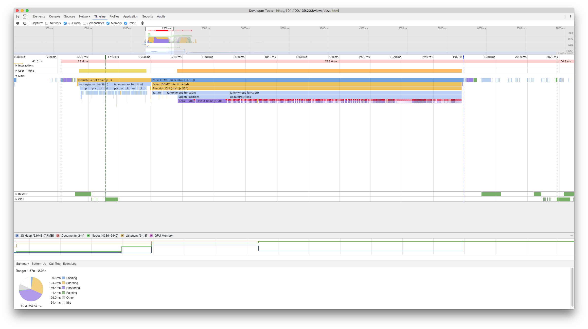
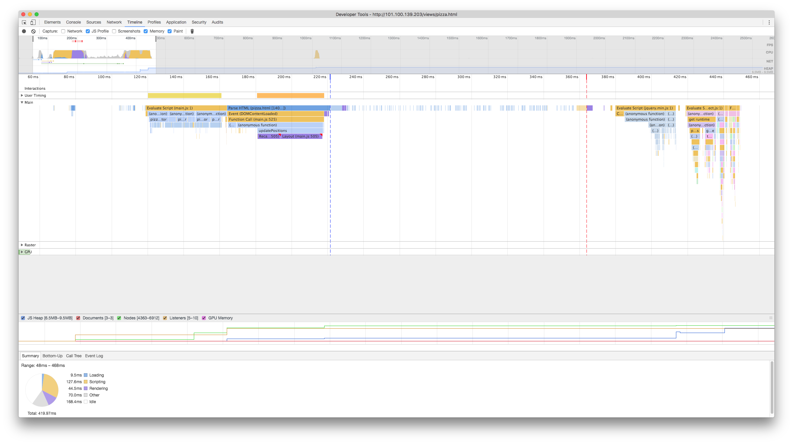
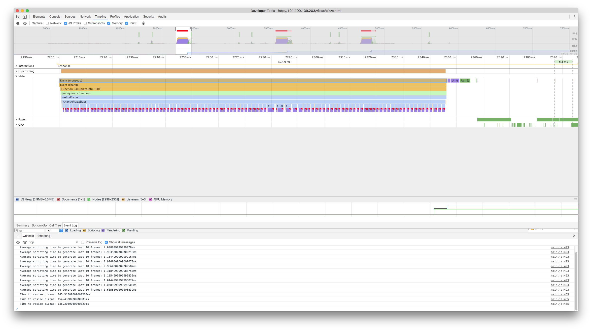
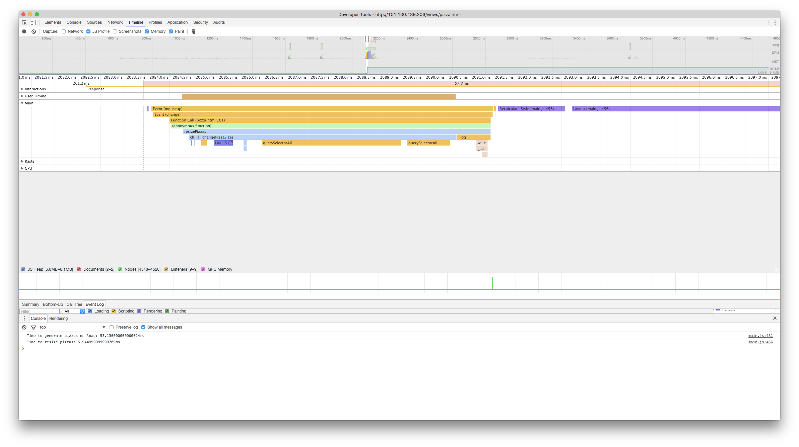

## Website Performance Optimization portfolio project

#### Note

[Part 1](https://mistertjb.github.io/frontend-nanodegree-mobile-portfolio/dist/index.html) and [Part 2](https://mistertjb.github.io/frontend-nanodegree-mobile-portfolio/dist/views/pizza.html) can be accessed via GitHub Pages.

### Part 1

#### Initial Analysis

Running PageSpeed over `index.html` without any optimisation gives a PageSpeed score of 77 for mobile, and 30 for desktop.

The most immediate concerns are render-blocking JavaScript and CSS, and image optimisation. Less pressing, for now, are caching, compression, and minification.

On review of `index.html`, it is obvious that the render-blocking `analytics.js` is superfluous: it doesn't contribute to the rendering of the page, and its execution could be deferred until rendering is complete.

As well, there are unnecessary stylesheets that are block rendering (namely `print.css`); PageSpeed also suggests 'optimising delivery' of the CSS for fonts.

It is difficult to imagine how `style.css` could be optimised away, given that it is necessary for rendering the page. Given that it is ~50 lines lone, and contains styles for dozens of elements, I'm hesitant to inline it.

Lastly, the CSS for the Open Sans font takes approximately 300ms to download. Removing the link to Open Sans improves the desktop score to 91, so it is important to determine whether any optimisation can be achieved here (assuming that Open Sans cannot be jettisoned altogether).

#### First Iteration

The goals of this first step are to remove (or minimise the effects of) any render-blocking CSS and Javascript.

First, the Open Sans CSS was examined to determine whether it could be optimised. The CSS returned by the Google API includes definitions for character sets that are unused in the copy on the page; as such, the latin font family definitions were moved in to `style.css`. This improves the PageSpeed score to 90 on desktop, though it is still 27 for mobile.

Assuming that Open Sans absolutely _must_ be included (it doesn't look substantially different than the system sans serif to me...), then it is hard to imagine how its footprint or latency could be improved (without some kind of lazy loading).

Secondly, a media query was added to the link to `print.css` so that it is only loaded when the browser attempts to print a page. This seemingly had no effect on the PageSpeed score. This file is tiny (481 bytes) and probably arrives long before `style.css` (3 KB), so its render-blocking effect is overwhelmed by the influence of `style.css`.

Lastly, the render-blocking Javascript pertaining to analytics (which can be deferred until the page is loaded) is annotated with the `async` directive, which allows the browser to initiate rendering without executing the Javascript.

Given that `analytics.js` takes 630ms to download, and then another 23ms to execute, this has a considerable effect on rendering.

The PageSpeed scores are now 29 and 92 for mobile and desktop, respectively. A major issue on mobile are the image sizes.

#### Second Iteration

The PageSpeed analysis indicates that `pizzeria.jpg` is unnecessarily large. On reviewing its `img` tag, it is clear that `pizzeria.jpg` need not be more than 100px wide (200px for 2x displays). As such, this image has been compressed and `index.html` has been updated to include a `srcset` attribute that loads the appropriate image for a given device.

This has improved the PageSpeed score to 86 and 88 on mobile and desktop.

#### Third Iteration

Given that I have no control over compression or caching (i.e. I'm using the Python `SimpleHTTPServer`, which seemingly doesn't allow for those parameters to be specified), the last option for improving the PageSpeed score is to minify HTML, CSS, and JavaScript.

Using `Gulp`, all of the Javascript, HTML, and CSS was minified. The resulting scores for mobile and desktop were 86 and 93, respectively; it seems that the last viable options afforded to me are to optimise `profilepic.jpg`, and to further optimise the `style.css`.

#### Final Iteration

In this final attempt, the critical CSS was identified using a [critical path generator](https://jonassebastianohlsson.com/criticalpathcssgenerator/) and then inlining this CSS, and loading the non-critical CSS at the end of the HTML document.

As well, `profilepic.jpg` was compressed to supress image optimisation warnings on PageSpeed.

This final iteration gives mobile and desktop scores of 95 when `index.html` is served from my local machine.

#### Recreating `/dist` with Gulp

As per the rubric, this section includes instructions for recreating the `/dist` folder with Gulp.

Gulp was used to generate the minified files in `/dist`. Assuming that `gulp`, `npm`, etc. are installed, this process can be reenacted by: 

1. Run `npm install` to create the `node_modules` directory containing dependencies
2. Run `gulp minify-html minify-css minify-js copy` to minify each of the HTML, CSS, and JS files, respectively, and copy over necessary assets from the `/src` directory (e.g. images, etc.)

### Part Two

#### Analysis (Scrolling)

To begin, a timeline was recorded during scrolling. The timeline shows that `updatePositions()` is causing a forced synchronous layout; this is an obvious opportunity for refactoring.

Reviewing timeline and the implementation of `updatePositions()`, it appears that `var phase = Math.sin((document.body.scrollTop / 1250) + (i % 5));` causes the forced synchronous layout when the `scrollTop` property is accessed. To prevent the forced synchronous layout on every iteration through the loop, it should be accessed once before the loop executes.

#### First Improvement

The access of `scrollTop` has been refactored out of the loop, which has solved the repeated forced synchronous layouts.

The logging code indicates that the `Average scripting time to generate last 10 frames` is approximately 1ms (versus 28ms in the unoptimised version).

#### Analysis (Resizing)

The average time to resize pizzas is reported by the logging code as being between 135-155ms. A review of the timeline shows that `determineDx` is causing a succession of forced synchronous layouts.

Reviewing `determineDx`, the issue appears to be related to the calls to `offsetWidth` on the pizza element, and the enclosing `div` for the pizzas. Given that pizzas are of a constant size, this probably doesn't need to be recomputed for each pizza.

To avoid layout thrashing, the code has been changed such that these properties are accessed once and passed in to `determineDx`.

As can be seen in the recorded timeline, this solves the layout thrashing issue.

The average time to resize pizzas is now approximately 9ms.

Reviewing the code again, it is obvious that a query selector is being run against the DOM on every iteration of the loop. Refactoring this out improves performance markedly: the average time required to resize pizzas is now approximately 6ms.

Another query selector was identified whose results could have been memoized. Doing so reduces the time to resize pizzas to between 1.5-2.5ms.

#### Analysis (Scrolling, revisited)

On reviewing the timeline for scrolling, with `updatePosition` (supposedly) optimised, it is clear that there are a handful of long-running frames that are still attributable to the `updatePosition` method.

Reviewing the method reveals expensive calls to `document.querySelectorAll('.mover')` that need not be repeated (i.e. this set of elements is consistent throughout the lifespan of the program).

This was refactored such that it was only called once.

The FPS meter in Chrome now shows 59.8 FPS during scrolling (with transient dips ~30FPS when scrolling direction, etc. changes).